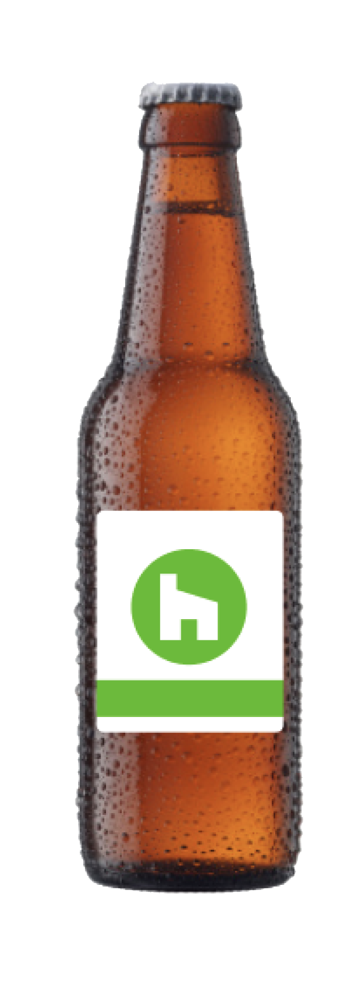

<h1>Beer Listing Application

## Available Scripts

`yarn start`

Runs the app in the development mode.
Open [http://localhost:3000](http://localhost:3000) to view it in the browser.

`yarn test`

Launches the test runner in the interactive watch mode.

`yarn build`

Builds the app for production to the `build` folder.\
It correctly bundles React in production mode and optimizes the build for the best performance.

This website is hosted on Vercel and it's live
[Click here to open Site](https://beer-listing.vercel.app)
[Click here to open demo video](https://www.loom.com/share/82c30b9b92d64502bccfe5f069850fbe)
